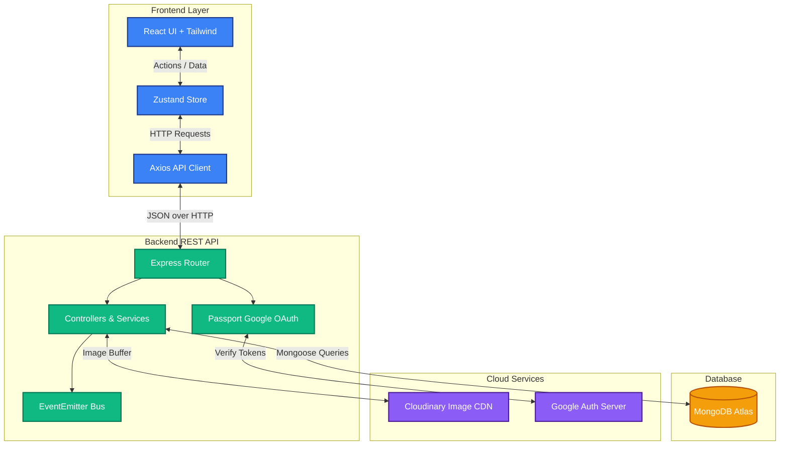
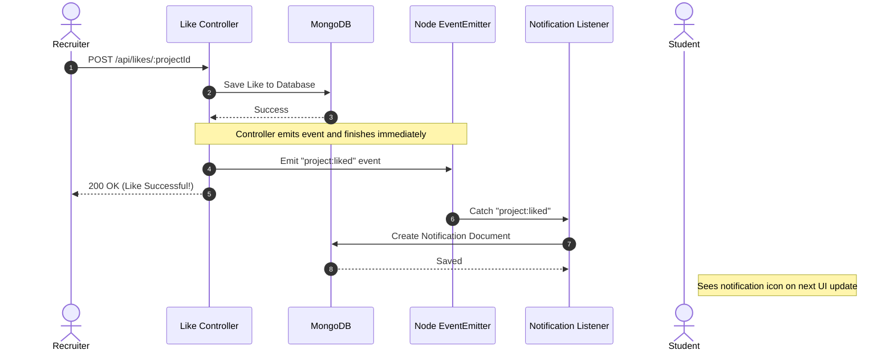

# 🎨 DevCanvas


**DevCanvas** is a premium, modern platform designed to bridge the gap between talented university students and tech recruiters. Students can build sleek portfolios to showcase their projects, while recruiters can easily search, discover, and connect with fresh talent.

---

## ✨ Features

- **Google OAuth 2.0:** Secure, seamless, password-less login.
- **Role-Based Access:** Distinct experiences for `STUDENTS` (upload portfolios), `RECRUITERS` (search and like), and `ADMINS` (system moderation).
- **Project Portfolios:** Students can upload projects with cover images, screenshot galleries, GitHub/Demo links, and technology tags.
- **Advanced Real-Time Search:** Client-side dynamic search to instantly filter projects by tags, title, or student name.
- **Cloudinary Integration:** Robust image uploading system backed by Multer with 5MB memory constraints.
- **Event-Driven Notifications:** Real-time background event listeners generate notifications when projects are liked.
- **Premium UI:** Built with Tailwind CSS featuring backdrop blurs, glassmorphism, responsive grids, and micro-animations.

---

## 🏗️ System Architecture

DevCanvas utilizes a decoupled, Monorepo architecture separating the Vite-powered React frontend from the Node/Express backend.



---

## 🔔 Event-Driven Notification System

To ensure a fast, non-blocking user experience, DevCanvas utilizes an asynchronous event-driven architecture for social interactions (like notifications).



---

## 🚀 Tech Stack

### Frontend
- **Framework:** React 18 powered by Vite
- **Styling:** Tailwind CSS
- **State Management:** Zustand
- **Routing:** React Router v6
- **HTTP Client:** Axios
- **Notifications:** React Toastify
- **Icons:** Lucide React

### Backend
- **Runtime:** Node.js
- **Framework:** Express.js
- **Database:** MongoDB & Mongoose
- **Authentication:** Passport.js (Google OAuth 2.0) & JSON Web Tokens (JWT)
- **Security:** Helmet, CORS
- **File Upload:** Multer & Cloudinary

---

## 🛠️ Local Development Setup

### Prerequisites
- Node.js (v18+)
- MongoDB connection string (Local or Atlas)
- Cloudinary Account (for image uploads)
- Google Cloud Console (for OAuth credentials)

### 1. Clone & Install
```bash
git clone https://github.com/Pabodha-Wann/dev-canvas.git
cd dev-canvas

# Install backend dependencies
cd backend
npm install

# Install frontend dependencies
cd ../frontend
npm install
```

### 2. Environment Variables
Create a `.env` file in the **backend** directory:
```env
PORT=5000
MONGODB_URI=your_mongodb_uri
CLIENT_URL=http://localhost:5173
JWT_SECRET=your_super_secret_key
NODE_ENV=development

# Google OAuth
GOOGLE_CLIENT_ID=your_google_client_id
GOOGLE_CLIENT_SECRET=your_google_client_secret

# Cloudinary
CLOUDINARY_CLOUD_NAME=your_cloud_name
CLOUDINARY_API_KEY=your_api_key
CLOUDINARY_API_SECRET=your_api_secret
```

Create a `.env` file in the **frontend** directory:
```env
VITE_API_URL=http://localhost:5000/api
```

### 3. Run the Application
Run both servers simultaneously in separate terminals:

**Terminal 1 (Backend):**
```bash
cd backend
npm run dev
```

**Terminal 2 (Frontend):**
```bash
cd frontend
npm run dev
```

The app will be running at `http://localhost:5173`.

---

## 📁 API Structure

| Endpoint | Method | Access | Description |
|----------|--------|--------|-------------|
| `/api/auth/google` | GET | Public | Initiate Google Login |
| `/api/auth/profile` | GET | Private | Get logged-in user details |
| `/api/projects` | GET | Public | Fetch all projects |
| `/api/projects` | POST | Student | Create a new project |
| `/api/projects/:id` | DELETE | Owner | Delete a project |
| `/api/likes/:projectId`| POST | Recruiter | Toggle a project like |
| `/api/notifications`| GET | Private | Fetch unread notifications|

---

## 👥 Contributors
Developed as part of the SE/2022 batch practical assignment. 
*Architected and led by the core DevCanvas Team.*

---

## Secure Web Application Assessment Mapping

DevCanvas adapts the bookfair stall-reservation workflow into a student project showcase workflow.

| Bookfair requirement | DevCanvas implementation |
| --- | --- |
| Stall Vendor | Student / Project Owner |
| Exhibition Organizer | Admin |
| Stall reservation | Project submission |
| Vendor profile | Student profile |
| Vendor's own reservations | Student's own projects |
| Organizer manages all reservations | Admin manages all projects |
| Exhibition/Event name | Project category |
| Stall type | Project type |
| Stall size | Technology stack / domain tags |
| Number of stalls | Team member count |
| Business category | Project category |
| Special requirements/comments | Project description and special comments |

The two mandatory assessment roles are covered by `STUDENT` and `ADMIN`. `RECRUITER` is an additional role for browsing, liking, and following student work.

## Security Controls

| OWASP area | DevCanvas control |
| --- | --- |
| Broken Access Control | Backend checks project owner before edit/delete and admin role before moderation |
| Authentication Failures | Cloud IdP login with Google OAuth/OIDC-style flow and signed JWT API access |
| Injection | Mongoose queries plus request rejection for `$` and dotted NoSQL operator keys |
| Security Misconfiguration | `helmet`, CORS origin config, `.env.example`, and `FORCE_HTTPS` |
| Cryptographic Failures | Secrets are stored in environment variables and HTTPS can be enforced behind a proxy |
| File Upload Risks | Multer memory storage, 5 MB limit, and JPG/PNG/WEBP MIME allow-list |
| Logging/Monitoring | Audit logs for project create/update/delete and admin moderation actions |
| XSS | React text rendering plus server-side string length limits and trimming |

## Security Testing Checklist

| Test | Expected result |
| --- | --- |
| Call protected API without `Authorization` header | `401 Unauthorized` |
| Student edits another student's project | `403 Forbidden` |
| Send NoSQL operator payload such as `{ "$ne": "" }` | `400 Bad Request` |
| Upload a non-image file as a project image | `400 Bad Request` |
| Recruiter/Admin accesses student-only project edit route | Redirect or `403 Forbidden` |

## Admin Login

To login as an admin during development or assessment demonstration:

1. Add your Google account email to `backend/.env`.

```env
ADMIN_EMAILS=your.email@example.com
```

Multiple admins can be configured with comma-separated emails.

```env
ADMIN_EMAILS=admin1@example.com,admin2@example.com
```

2. Restart the backend server.
3. Login with Google using that email address.

If the user already exists as a student/recruiter, promote the account after logging in once:

```bash
cd backend
npm run admin:promote -- your.email@example.com
```
